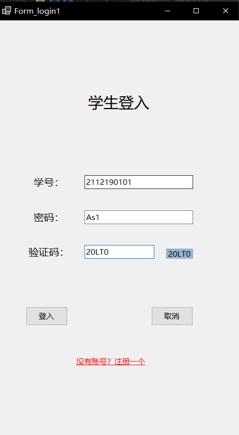
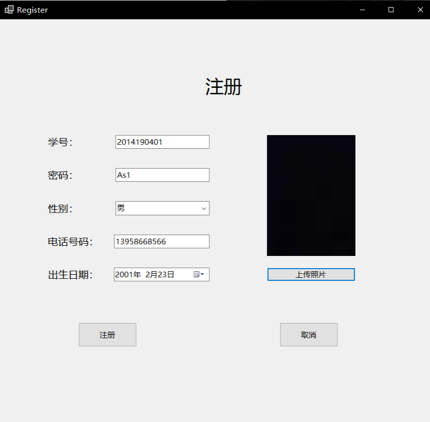

## 开发环境说明

- 编程工具：C#
- 数据库系统：SQL Server 2019
- 设计工具：Visual Studio 2022，Visio 2021
- 系统版本：Microsoft Windows 10

## 需求分析

### 用户需求

- 管理功能：学生信息、成绩信息、组织架构、学籍状况、评奖评优及课程信息管理。
- 查询功能：学生信息、成绩、课程情况查询。
- 信息化：减少出错率，提高管理效率。

### 功能需求

- **管理员**: 录入、查询、删除、修改、添加信息等操作。
- **学生**: 查看基本信息、成绩信息及评奖评优状况。

### 系统基本需求

- 学生信息：学号、姓名、性别、年龄、专业
- 成绩信息：学号、课程、成绩
- 用户信息：账号、密码、性别、生日、手机号、照片
- 管理员信息：同用户信息
- 组织架构信息：学院、专业、班级
- 评奖评优信息：学号、奖项

